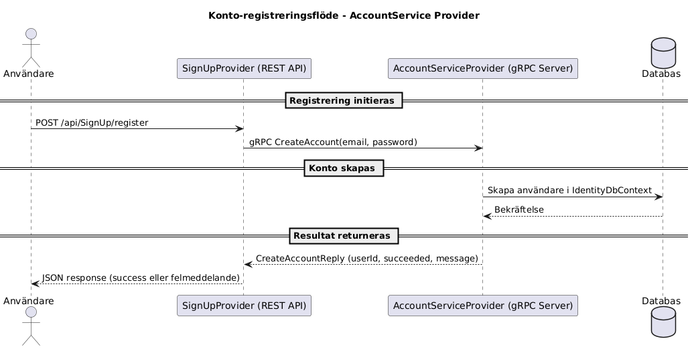
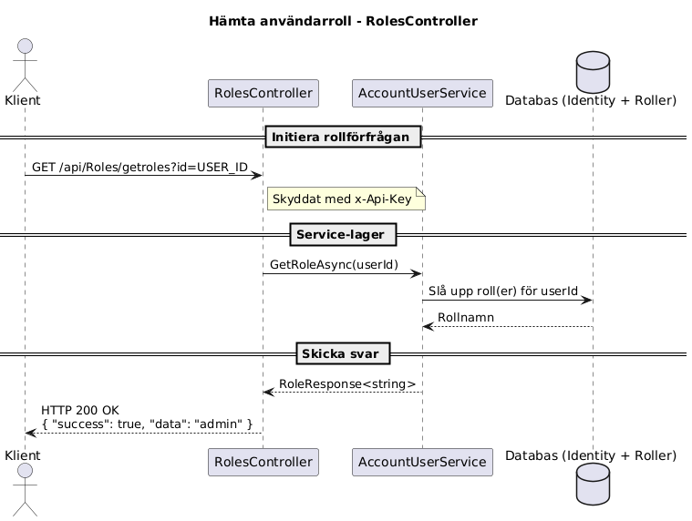

# AccountService Provider

AccountService Provider är en mikrotjänst byggd med ASP.NET Core Web API och gRPC. Tjänsten hanterar kontoskapande, autentisering, rollhantering samt konto- och e-postverifiering. Den fungerar som backend för användar- och kontorelaterade operationer och används av andra mikrotjänster, som t.ex. SignUpProvider.

---

## Funktionalitet

- gRPC-metoder för:
  - Skapa konto (`CreateAccount`)
  - Validera inloggningsuppgifter
  - Hämta konton och detaljer
  - Uppdatera e-post och telefonnummer
  - Generera och bekräfta verifieringstoken
  - Återställa lösenord
  - Ta bort konto

- REST API-endpoints:
  - `GET /api/Roles/getroles`: Hämta användarroll(er)
  - `POST /api/UserExist/userexist`: Kontrollera om användare existerar

- Skydd av alla API-endpoints med `x-Api-Key`
- Dokumentation via Swagger UI

---

## Teknologier

- .NET 9.0
- ASP.NET Core Web API
- ASP.NET Core gRPC
- Entity Framework Core
- SQL Server / InMemory (valbart)
- Swagger / OpenAPI
- ASP.NET Core Identity

---

## Kom igång

### 1. Klona projektet

```
git clone <https://github.com/CMS24-Grupp-5/AccountServiceProvider.git>
cd AccountServiceProvider
```
2. Konfigurera appsettings.json
```
{
  "ConnectionStrings": {
    "DefaultConnection": "Server=(localdb)\\mssqllocaldb;Database=AccountDb;Trusted_Connection=True;"
  },
  "Apikeys": {
    "StandardApiKey": "din-hemliga-nyckel"
  }
}
```
3. Bygg och kör projektet
```
dotnet build
dotnet run
```
Swagger UI är tillgängligt på:

```
https://localhost:<port>/swagger
gRPC-tjänster är tillgängliga via port 5001 med HTTP/2 och TLS.
```
Säkerhet
Alla API-endpoints skyddas med API-nyckel. Skicka följande header i varje request:

```
x-Api-Key: din-hemliga-nyckel
Exempel: REST-anrop
Kontrollera om användare existerar
POST /api/UserExist/userexist?id=USER_ID
```
Response (200 OK):
true
Response (400 Bad Request):
false
Hämta roll för användare
```
GET /api/Roles/getroles?id=USER_ID
```
Response (200 OK):
```
{
  "success": true,
  "message": "Role fetched",
  "data": "admin"
}
```
Kommunikation via gRPC
Tjänsten exponerar följande gRPC-metoder i account.proto:

protobuf
```
service AccountGrpcService {
  rpc CreateAccount (CreateAccountRequest) returns (CreateAccountReply);
  rpc ValidateCredentials (ValidateCredentialsRequest) returns (ValidateCredentialsReply);
  rpc GetAccounts (GetAccountsRequest) returns (GetAccountsReply);
  rpc GetAccountById (GetAccountByIdRequest) returns (GetAccountByIdReply);
  rpc UpdatePhoneNumber (UpdatePhoneNumberRequest) returns (UpdatePhoneNumberReply);
  rpc DeleteAccount (DeleteAccountRequest) returns (DeleteAccountReply);
  rpc ConfirmAccount (ConfirmAccountRequest) returns (ConfirmAccountReply);
  rpc UpdateEmail (UpdateEmailRequest) returns (UpdateEmailReply);
  rpc ConfirmEmailChange (ConfirmEmailChangeRequest) returns (ConfirmEmailChangeReply);
  rpc ResetPassword (ResetPasswordRequest) returns (ResetPasswordReply);
  rpc GenerateEmailConfirmationToken (GenerateTokenRequest) returns (GenerateTokenReply);
  rpc GeneratePasswordResetToken (GenerateTokenRequest) returns (GenerateTokenReply);
}
```
Sekvensdiagram
Nedan visas ett förenklat flöde när t.ex. ett konto skapas via en annan tjänst eller hämta en role via Rest:


